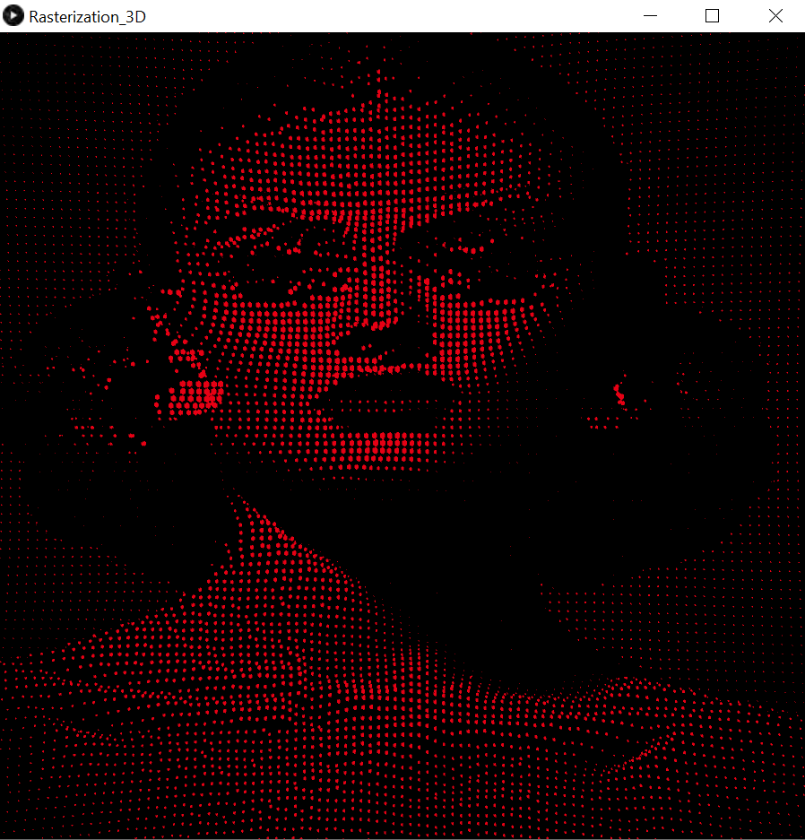

# Computer-Graphics
This project uses the concept of rasterization. The output of this project will be a rasterized image in three dimensions where the brightness of each pixel in the image is used to get the required form. The image to be rasterized will be given in inputs as a read file(jpg).

